# Exercice 04 : Devine mon nombre
## durée : 240'
## Objectifs visés :
Maitriser les diagrammes de séquence ; Maitriser les diagrammes de classes ; Savoir se référer à la Javadoc ; Maîtrise de MVC avec Ihm simple fournie

## Travail à réaliser
Lisez avec attention les informations fournies ci-après sous diverses formes (diagramme de classe, javadoc, diagrammes de séquence, …) car vous y trouverez toutes les informations utiles afin de finaliser le projet Java « DevineMonNombre ».

## Résultat à obtenir
Si votre code est correctement implémenté selon les directives reçues, vous devriez obtenir une application fonctionnelle ressemblant à cela à son démarrage :
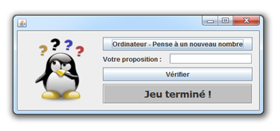
## Description des fonctionnalités de l’application
Les deux seuls boutons de l’application permettent de :
-	démarrer une nouvelle partie (bouton « Ordinateur – Pense à un nouveau nombre »)
-	tenter de deviner le nombre (bouton « Vérifier »).

| Pression du bouton | Résultats possibles| Aperçu |
| :--------------- |:---------------| :----------------|
| Ordinateur - Pense à un nouveau nombre  | L’ihm affichera ceci afin d’indiquer qu’un nouveau jeu a démarré :        |  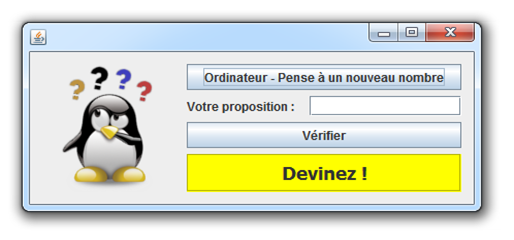 |
| Vérifier  | Si le jeu n’avait pas encore été démarré, l’ihm affichera ceci pour indiquer cela : | 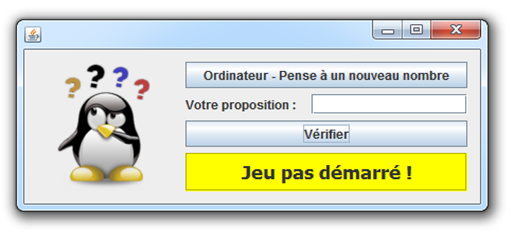 |
| Vérifier | Si le jeu a été démarré et que la proposition de nombre saisie ne constitue pas un nombre valable, l’ihm affichera ceci pour l’indiquer : |    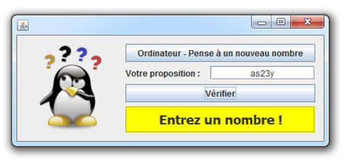 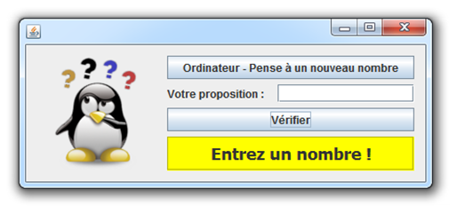
| Vérifier | Si le jeu a été démarré, l’ihm affichera ceci pour indiquer que la proposition du joueur est trop petite : |    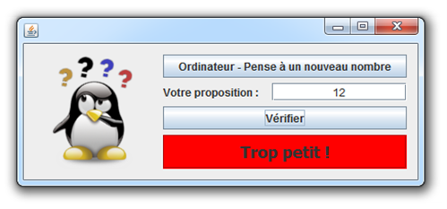 
| Vérifier | Si le jeu a été démarré, l’ihm affichera ceci pour indiquer que la proposition du joueur est trop grande : |    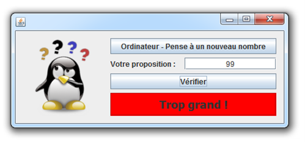 
| Vérifier | Si le jeu a été démarré, l’ihm affichera ceci pour indiquer que la proposition du joueur est correcte : |    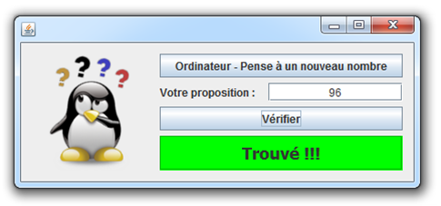 

## Diagramme de classes
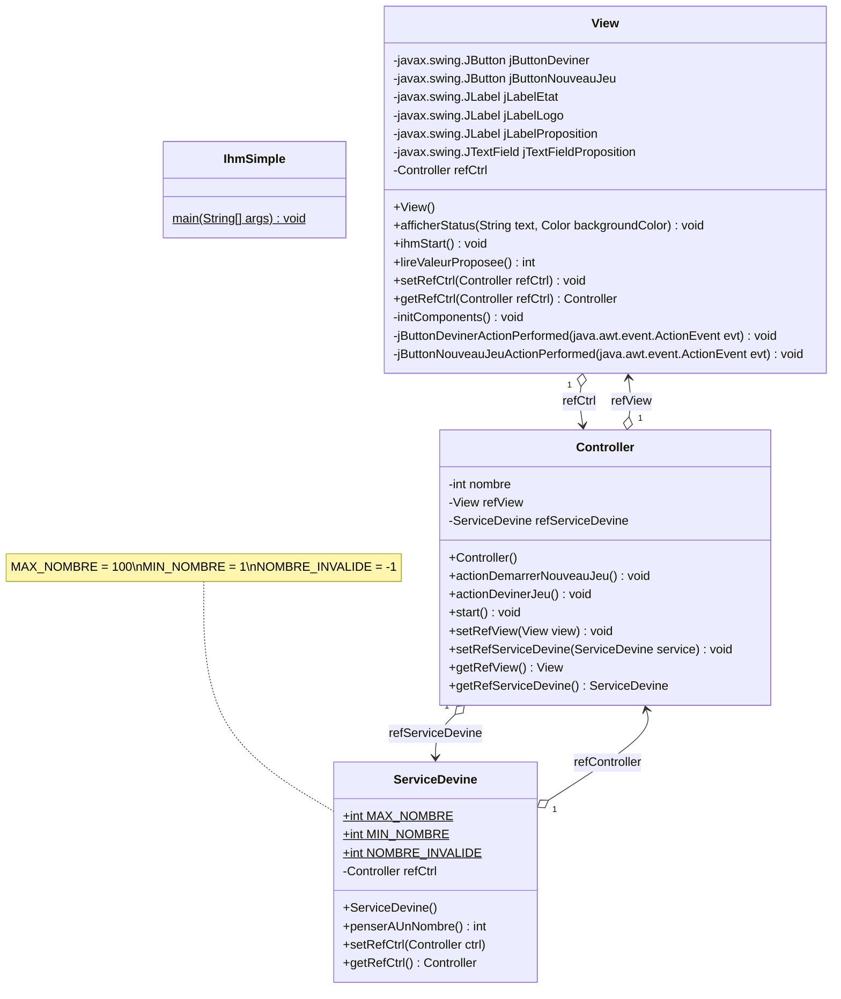

## Structure des packages Java
Voici la structure des packages pour chaque classe du projet
```mermaid
classDiagram
namespace ihmsimple {
    class app
    class views
    class ctrl
    class services
}
namespace app {
    class IhmSimple
}
namespace views {
    class View
}
namespace ctrl {
    class Controller 
}
namespace services {
    class ServiceDevine 
}

```

## Diagramme de séquence
### ihmsimple.app.IhmSimple.main()
Voici le diagramme de séquence de la méthode de la méthode `main()` de la classe `IhmSimple` du package `app` :
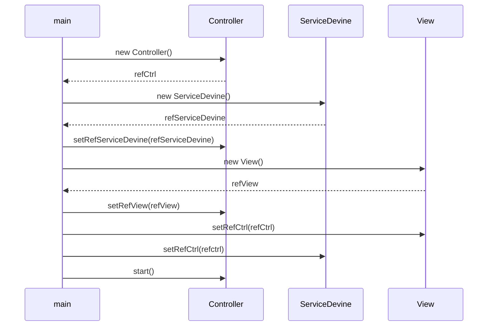
### ihmsimple.ctrl.Controller.start()
Voici le diagramme de séquence de la méthode de la méthode `start()` de la classe `Controller` du package `ctrl` :
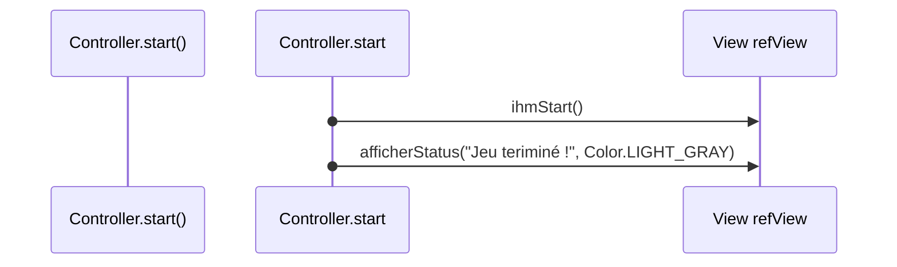
### ihmsimple.ctrl.Controller.actionDemarrerNouveauJeu()
Voici le diagramme de séquence de la méthode de la méthode `actionDemarrerNouveauJeu()` de la classe `Controller` du package `ctrl` :
```mermaid
sequenceDiagram
    participant Controller.actionDemarrerNouveauJeu()
    Controller.actionDemarrerNouveauJeu()->>ServiceDevine refServiceDevine: penserAUnNombre()
    ServiceDevine refServiceDevine-->>Controller.actionDemarrerNouveauJeu(): nombre=
    Controller.actionDemarrerNouveauJeu()->>View refView: afficherStatus("Devinez !", Color.YELLOW)
```
### ihmsimple.ctrl.Controller.actionDeviner()
Voici le diagramme de séquence de la méthode de la méthode `actionDeviner()` de la classe `Controller` du package `ctrl` :
```mermaid
sequenceDiagram
    participant Controller.actionDeviner()
    alt nombre IS NOT NOMBRE_INVALIDE
        Controller.actionDeviner()->>View refView: lireValeurProposee()
        View refView-->>Controller.actionDeviner(): valeurProposee=
        alt ValeurProposee IS NOT NOMBRE_INVALIDE
            alt ValeurProposee < nombre
               Controller.actionDeviner()->>View refView: afficherStatus("Trop petit !", Color.RED)
            else ValeurProposee > nombre
                Controller.actionDeviner()->>View refView: afficherStatus("Trop grand !", Color.RED)
            else
                Controller.actionDeviner()->>View refView: afficherStatus("Trouvé !!!", Color.GREEN)            
            end 
        else
            Controller.actionDeviner()->>View refView: afficherStatus("Entrez un nombre !", Color.YELLOW)
        end

    end
```
## Javadoc
Vous pouvez cliquer sur [ce lien pour obtenir la JavaDoc en HTML](javadoc/index.html) de l'application IhmSimple.

